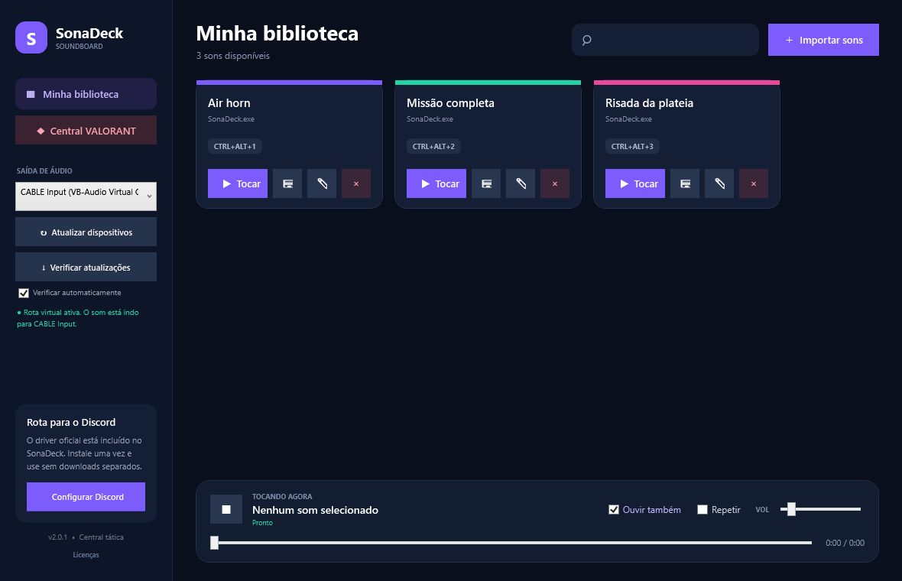
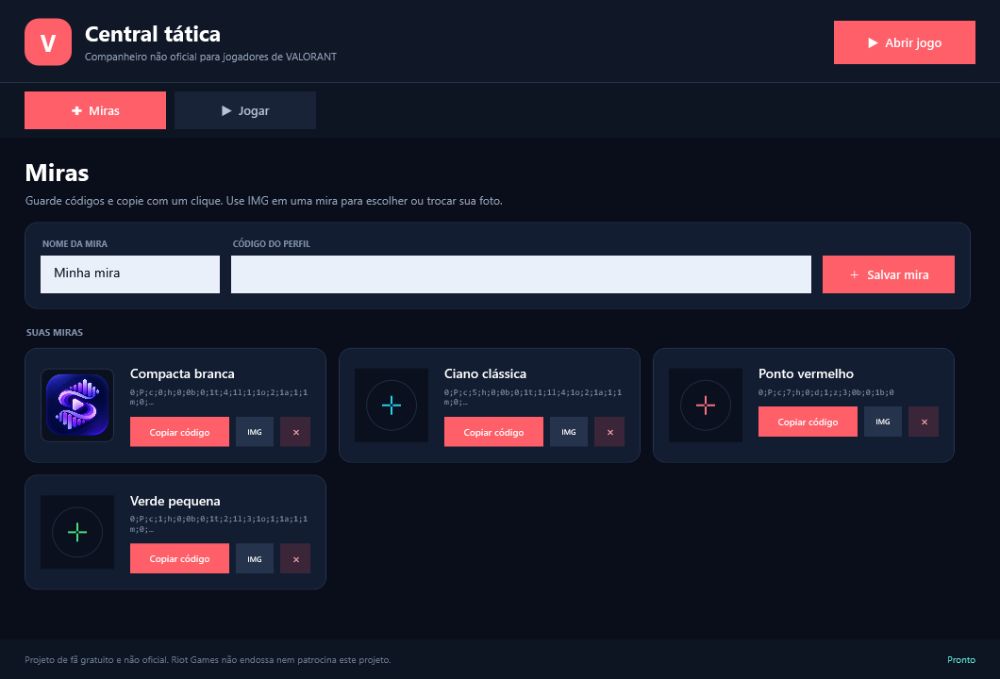

# SonaDeck

Soundboard leve e central tática para Windows, com reprodução de memes, atalhos globais, rota para Discord e atualizações automáticas.

## Baixar

[Baixar a versão mais recente](https://github.com/srbiscoito12/SonaDeck/releases/latest/download/SonaDeck.exe)

## Novidades da versão 2.0

- Miras: salve e copie códigos de perfil.
- Jogar: detecte e abra o cliente oficial do VALORANT.
- Conversas: copie mensagens rápidas para o time.
- Calls: consulte lembretes dos mapas.
- O soundboard e a saída para o Discord continuam incluídos.

## Atualizações

Quem já instalou o SonaDeck pode usar **Verificar atualizações**. O aplicativo também procura novas versões automaticamente.

## Aviso

Projeto de fã gratuito e não oficial. Riot Games não endossa nem patrocina este projeto.
