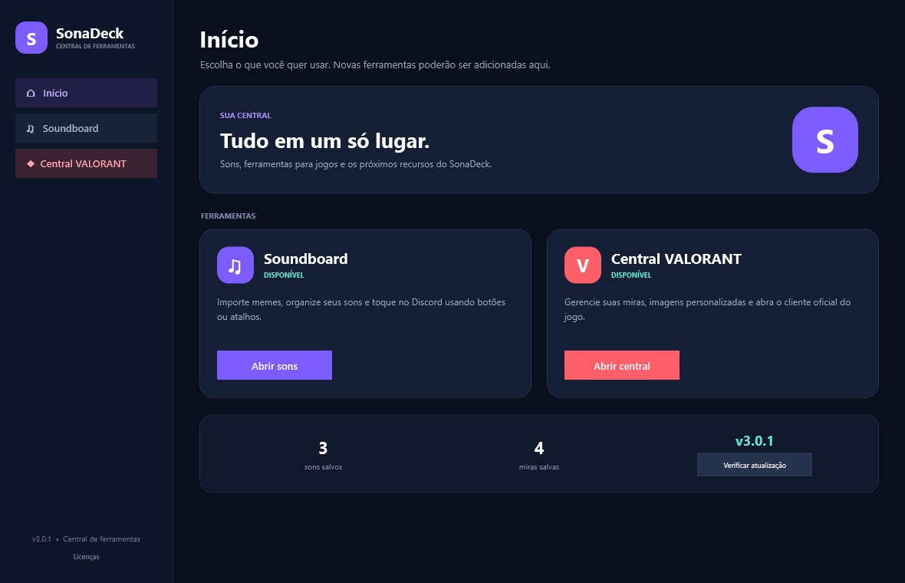
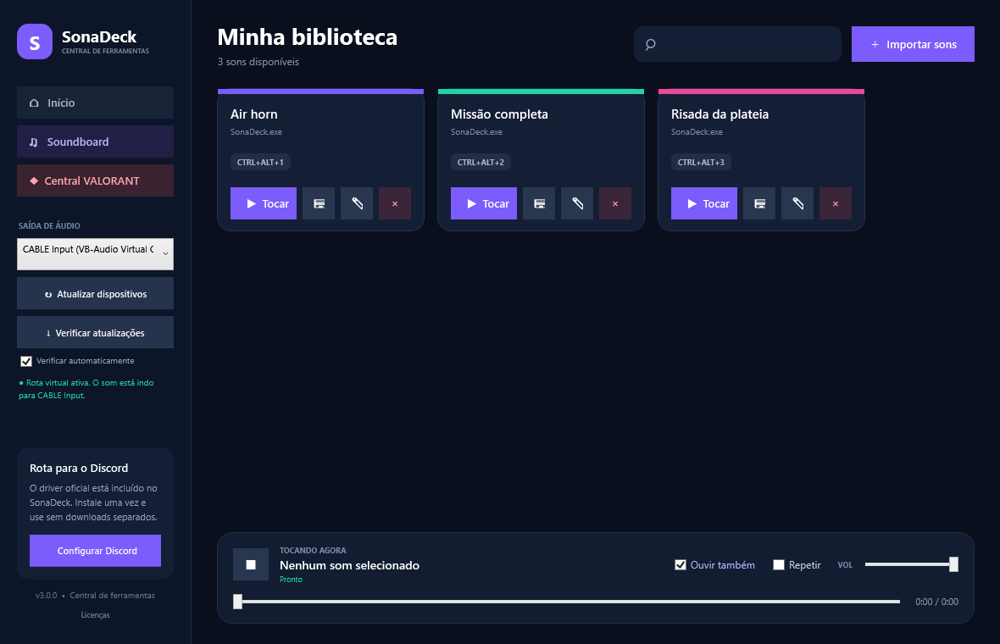

# SonaDeck

Central de ferramentas para Windows. O SonaDeck reúne soundboard, recursos para jogos e espaço para novas ferramentas em um único aplicativo.

## Baixar

[Baixar a versão mais recente](https://github.com/srbiscoito12/SonaDeck/releases/latest/download/SonaDeck.exe)

## Ferramentas

- **Início:** atalhos para todos os recursos, contadores e atualização do aplicativo.
- **Soundboard:** importe memes, use atalhos globais e envie sons para o Discord.
- **Central VALORANT:** abre dentro da janela principal, onde você pode salvar miras, escolher imagens personalizadas e iniciar o cliente oficial do jogo.

As três páginas utilizam a mesma barra de navegação. A estrutura está preparada para receber novas ferramentas.

## Atualizações

Quem já instalou o SonaDeck pode usar **Verificar atualizações**. O aplicativo também procura novas versões automaticamente.

## Aviso

Projeto de fã gratuito e não oficial. Riot Games não endossa nem patrocina este projeto.
